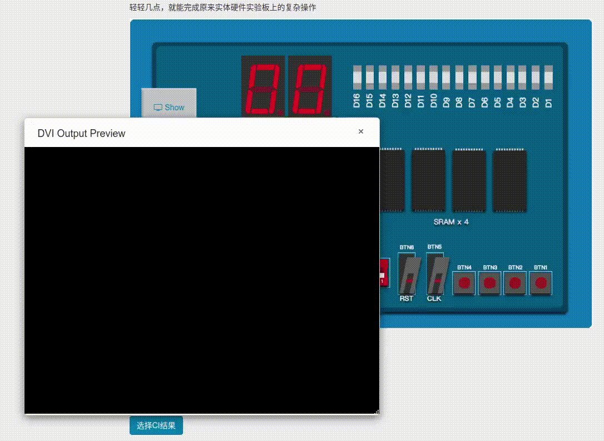

# SPIM32-Snake
A retro snake game implemented in MIPS32 assembly. Tested on FPGA hardware with 4 GPIO buttons as input (up, down, left, right respectively).

## Demo

## How to Use
The codes related to retro snake are [display.S](kernel/kern/display.S) and [snake.S](kernel/kern/snake.S), along with some interruption handlers in [trap.S](kernel/kern/trap.S). Refer to [README of the kernel](./Supervisor_README.md) for the use of supervisor kernel.  

In a typical TLB-enabled image (available on [release](https://github.com/zx1239856/SPIM23-Snake/releases)), the entry address of retro snake is `0x80003000`.
